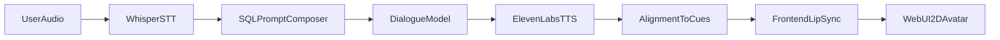

# 10-Minute Research Presentation Outline

## Title
**A Real-Time 2D Virtual Patient for Motivational Interviewing Training**  
Subtitle: SQL-Guided Prompting, Whisper STT, ElevenLabs TTS, and LoRA-Driven Visemes

## Audience
Academic/research faculty

## Timing Plan (10:00 total)

### Slide 1 (0:00-0:50) - Clinical Training Problem
- Motivational interviewing (MI) is high-impact but difficult to practice safely and repeatedly.
- Human standardized-patient training is expensive and not always available.
- We need a scalable, reproducible, and realistic training alternative.

### Slide 2 (0:50-1:45) - Research Gap and Novelty
- Existing conversational agents often optimize text quality, not multimodal MI realism.
- Existing avatar systems often target entertainment, not behaviorally grounded MI pedagogy.
- Gap: limited work on low-latency, web-deployable **2D** avatars tailored for MI training loops.
- Novelty contribution:
  - SQL-controlled MI behavior layer (global + case-level prompts),
  - real-time speech-to-dialogue-to-speech loop with lip cues,
  - LoRA-based personalization pipeline to synthesize 10 visemes from user-defined character input.

### Slide 3 (1:45-2:35) - End-to-End System Architecture
- User speech input -> Whisper STT -> MI-guided LLM response -> ElevenLabs TTS with alignment -> viseme cues -> 2D avatar rendering.
- WebSocket orchestration enables turn-level streaming and low perceived latency.
- Emphasize modularity: each component can be swapped/improved independently.

### Slide 4 (2:35-3:25) - SQL Global Prompt Access for MI Control
- Global behavioral prompt is persisted in SQL settings and merged with case-specific system prompts.
- This enables central governance plus scenario-specific customization.
- Benefit for research: reproducibility across cohorts with controlled prompt intervention.

### Slide 5 (3:25-4:25) - ElevenLabs TTS and Alignment to Visemes
- TTS generated using ElevenLabs APIs; timestamp alignment drives cue extraction.
- Slider concepts (stability, similarity_boost, style):
  - `stability`: prosody consistency,
  - `similarity_boost`: voice identity closeness,
  - `style`: expressive coloration.
- These controls are present in config and can be used for voice behavior experiments.
- Cue timeline is converted to mouth-shape states for frame-level lip-sync.

### Slide 6 (4:25-5:10) - Whisper STT for User Speech Understanding
- Client records microphone audio and streams base64 chunks to backend.
- Whisper transcribes speech to text for dialogue processing.
- Output transcript is surfaced in UI and fed into response generation.

### Slide 7 (5:10-6:20) - Lip-Sync Pipeline
- Backend emits audio chunks and synchronized cue packets.
- Frontend audio queue plays chunks sequentially while a render loop applies cue timing.
- Viseme mapping (`A-H`, `X`, `blink`) drives image-swap mouth animation.
- Outcome: coherent audio-articulation coupling in a low-cost 2D stack.

### Slide 8 (6:20-7:35) - LoRA Fine-Tuning for 10 Visemes
- Stable Diffusion 1.5 is adapted with LoRA on viseme-labeled data.
- Pipeline:
  - create/curate viseme dataset metadata,
  - train LoRA adapters on UNet attention blocks,
  - optionally merge adapters for faster inference,
  - generate full 10-viseme sets from prompt or reference-A image.
- Research value: identity-consistent avatar mouth sets with reduced compute cost.

### Slide 9 (7:35-8:40) - Head Motion Math
- Current implementation is intentionally static (`0` motion) for stability baseline.
- Render transform already supports future dynamics:
  - yaw: `rotateY(headXDeg)`,
  - pitch: `rotateX(-headYDeg)`,
  - roll: `rotate(headTiltDeg)`,
  - eye offsets via object-position translation.
- Proposed extension: drive `headXDeg/headYDeg/headTiltDeg` from prosody energy and pause structure.

### Slide 10 (8:40-10:00) - Web UI, Impact, and Next Studies
- UI includes authentication, role-based dashboards, case management, and live practice session.
- Practical contribution: deployable browser-based MI rehearsal platform.
- Study-ready next steps:
  - compare MI skill gain vs text-only chatbot baseline,
  - test voice slider settings vs learner perceived empathy,
  - evaluate personalized vs generic viseme sets on engagement and realism.

---

## Suggested Figure 1: End-to-End Runtime Flow

## Suggested Figure 2: LoRA Viseme Generation

