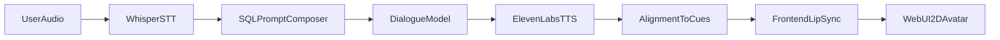

# PowerPoint-Ready Content: 10-Minute MI Avatar Research Talk

## Slide 1 - Title and Motivation
**Slide title:** A Real-Time 2D Virtual Patient for Motivational Interviewing (MI)

**On-slide bullets**
- Goal: scalable MI practice with realistic conversational behavior.
- Approach: multimodal web system combining STT, LLM prompting, TTS, and avatar animation.
- Setting: browser-based training workflow for educational use.

**Speaker notes (35-45s)**
This project addresses a practical bottleneck in MI education: learners need repeated, safe, realistic conversation practice, but human role-play resources are limited. We built a deployable 2D virtual patient platform that supports full voice interaction, MI-guided responses, and synchronized facial articulation.

---

## Slide 2 - Research Gap and Contribution
**Slide title:** Gap and Novelty

**On-slide bullets**
- Gap 1: MI systems are often text-centric, with weak embodied interaction.
- Gap 2: avatar systems are often visual demos, not behaviorally grounded clinical training tools.
- Gap 3: few low-cost 2D pipelines unify MI prompting, speech loop, and personalized visemes.
- Contribution: integrated, modular architecture for MI-specific, real-time, personalized 2D simulation.

**Speaker notes (45-55s)**
The key novelty is not just a chatbot and not just an avatar. The contribution is an integrated educational stack: SQL-governed MI prompt composition, realtime STT/TTS with alignment, and LoRA-based viseme personalization from user-defined characters. This creates a practical path toward scalable MI rehearsal and controlled research studies.

---

## Slide 3 - End-to-End Architecture
**Slide title:** Runtime Pipeline Overview

**On-slide bullets**
- User speech enters via browser microphone.
- Whisper transcribes speech into text.
- Backend composes MI behavior prompts and gets model response.
- ElevenLabs returns speech plus timing alignment.
- Frontend maps timing cues to viseme frames (`A-H`, `X`, `blink`).

**Figure (paste into slide notes or appendix)**

**Speaker notes (45-55s)**
The architecture is organized as a closed speech loop. WebSocket events coordinate each turn end-to-end. Because transcription, response generation, and speech synthesis are streamed, the user experiences a responsive dialogue while the avatar remains synchronized.

---

## Slide 4 - SQL Global Prompt Access for MI Behavior
**Slide title:** Prompt Orchestration via SQL

**On-slide bullets**
- Global prompt stored as app setting in SQL (`global_prompt`).
- Case-level prompt stored per scenario (`Case.system_prompt`).
- Session logic merges global + case prompts to form final behavior policy.
- Enables controlled MI persona consistency across all sessions.

**Implementation anchors**
- `backend/main.py` (WebSocket setup and prompt merge)
- `backend/models/db_models.py` (`AppSettings`, `Case`)
- `backend/routes/settings.py` (read/update global prompt)

**Speaker notes (50-60s)**
This design matters for research reproducibility. Faculty can update one global MI policy and keep it consistent across multiple cases and cohorts, while preserving case-specific nuance. It also makes prompt interventions experimentally tractable.

---

## Slide 5 - ElevenLabs TTS and Slider Concepts
**Slide title:** TTS, Alignment, and Voice Controls

**On-slide bullets**
- ElevenLabs synthesis returns audio and alignment metadata.
- Alignment is transformed into time-stamped cue sequence for lip-sync.
- Voice slider dimensions:
  - `stability` (prosodic consistency),
  - `similarity_boost` (voice identity adherence),
  - `style` (expressiveness).
- Config defaults exist; these are ready for controlled ablation studies.

**Implementation anchors**
- `backend/services/tts_service.py`
- `backend/config.py`

**Speaker notes (55-65s)**
A key technical choice is to treat TTS as both sound generation and articulation signal generation. Alignment timestamps become direct inputs to viseme scheduling. The voice-control parameters are useful for experiments around perceived empathy, consistency, and realism.

---

## Slide 6 - Whisper STT for User Turns
**Slide title:** Speech-to-Text Loop

**On-slide bullets**
- Browser recorder captures mic audio and transmits base64 chunks.
- Backend decodes and transcribes with Whisper (`whisper-1` default).
- Transcript is shown in UI and fed to dialogue generation.
- Keeps interaction voice-first while preserving text traceability.

**Implementation anchors**
- `frontend-react/src/hooks/useVoiceRecorder.ts`
- `backend/services/stt_service.py`
- `backend/main.py`

**Speaker notes (40-50s)**
Whisper provides robust transcription for natural user speech. Architecturally, STT is a first-class module in the turn loop, not an add-on, so the system can support both verbal interaction and transcript-based assessment downstream.

---

## Slide 7 - Lip-Sync Mechanics
**Slide title:** From Audio Alignment to Mouth Animation

**On-slide bullets**
- Backend emits `audio_chunk` events with encoded audio + cue array.
- Frontend queue plays chunked audio in order.
- Render loop applies cue timing to update active mouth shape.
- `PatientAvatar2D` swaps sprite images by current viseme.

**Implementation anchors**
- `backend/main.py`
- `frontend-react/src/hooks/useAudioPlayback.ts`
- `frontend-react/src/components/PatientAvatar2D.tsx`

**Speaker notes (55-65s)**
The lip-sync pipeline separates concerns cleanly: backend decides timing, frontend decides frame display. This minimizes visual drift and keeps animation deterministic for the same cue stream. It also allows future replacement of either cue generator or renderer independently.

---

## Slide 8 - LoRA Fine-Tuning for 10 Visemes
**Slide title:** Personalized Viseme Generation via LoRA

**On-slide bullets**
- Base: Stable Diffusion 1.5; adapter: LoRA on UNet attention layers.
- Target set: 10 visemes (`A-H`, `X`, `blink`) per character identity.
- Input modes:
  - text prompt -> generate `A` then derive remaining shapes,
  - reference `A` image -> generate remaining shapes.
- Benefit: identity-consistent mouth-shape packs at lower fine-tuning cost.

**Figure**

```mermaid
flowchart LR
inputChar[UserCharacterInput] --> visemeDataset[VisemeDatasetMetadata]
visemeDataset --> loraTrain[LoRATrainingUNet]
loraTrain --> loraAdapter[LoRAAdapter]
loraAdapter --> inferA[GenerateVisemeA]
inferA --> inferRest[Img2ImgGenerateBtoHXBlink]
inferRest --> visemePack[TenVisemePack]
visemePack --> avatarRuntime[RuntimeMouthFrames]
```

**Implementation anchors**
- `backend/scripts/train_viseme_lora.py`
- `backend/services/viseme_generation_service.py`
- `backend/services/custom_viseme_generator.py`
- `backend/viseme_lora_dataset/metadata.jsonl`

**Speaker notes (60-70s)**
This section is the personalization engine. Rather than hand-crafting all viseme images for each new avatar, LoRA adaptation allows efficient synthesis of consistent viseme sets. That supports practical scaling for educational deployments where visual identity diversity matters.

---

## Slide 9 - Head Movement Math
**Slide title:** Motion Model and Geometric Transform

**On-slide bullets**
- Current baseline uses static motion outputs (all zeros) for stability.
- Render stack already supports 3-axis head transform and eye offsets.
- Applied transform:
  - yaw: `rotateY(headXDeg)`
  - pitch: `rotateX(-headYDeg)`
  - roll: `rotate(headTiltDeg)`
- Future math link: estimate motion from prosody features:
  - `headXDeg = k1 * normalizedEnergy(t)`
  - `headTiltDeg = k2 * intonationDelta(t)`

**Implementation anchors**
- `frontend-react/src/hooks/useAvatarMotion.ts`
- `frontend-react/src/components/PatientAvatar2D.tsx`

**Speaker notes (45-55s)**
The project currently uses a static head baseline to avoid introducing unstable motion artifacts. Importantly, the transform interface is already present, so future work can insert a signal-driven motion model without redesigning the renderer.

---

## Slide 10 - Web UI, Impact, and Research Next Steps
**Slide title:** Interface Integration and Study Roadmap

**On-slide bullets**
- Complete web UI: auth, role dashboards, case assignment, live practice session.
- Real-time conversation interface with transcript and animated avatar response.
- Immediate value: repeatable MI practice in a browser-only workflow.
- Next evaluations:
  - MI skill gain vs text-only baseline,
  - perceived empathy vs voice slider settings,
  - learner engagement vs personalized visemes.

**Implementation anchors**
- `frontend-react/src/App.tsx`
- `frontend-react/src/pages/PracticeSession.tsx`
- `frontend-react/src/pages/AdminDashboard.tsx`
- `frontend-react/src/pages/StudentDashboard.tsx`

**Speaker notes (50-60s)**
The core message is translational impact: this is not only a technical demo but a research-ready educational platform. It enables controlled studies on communication quality, embodiment effects, and personalization in MI training at scale.

---

## Backup Slide (Optional Q&A)
**Slide title:** Known Limitations

**On-slide bullets**
- Head motion is currently static.
- Per-case viseme URL support can be expanded in frontend runtime wiring.
- TTS slider parameters are defined in config and positioned for deeper runtime experimentation.
- Clinical validation is future work.
